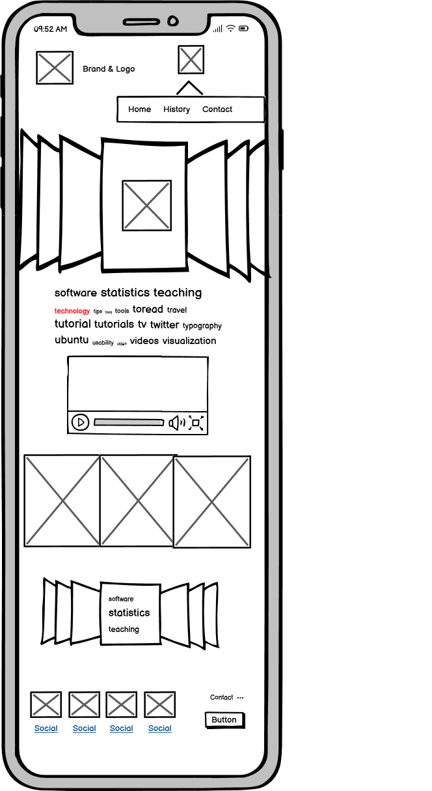
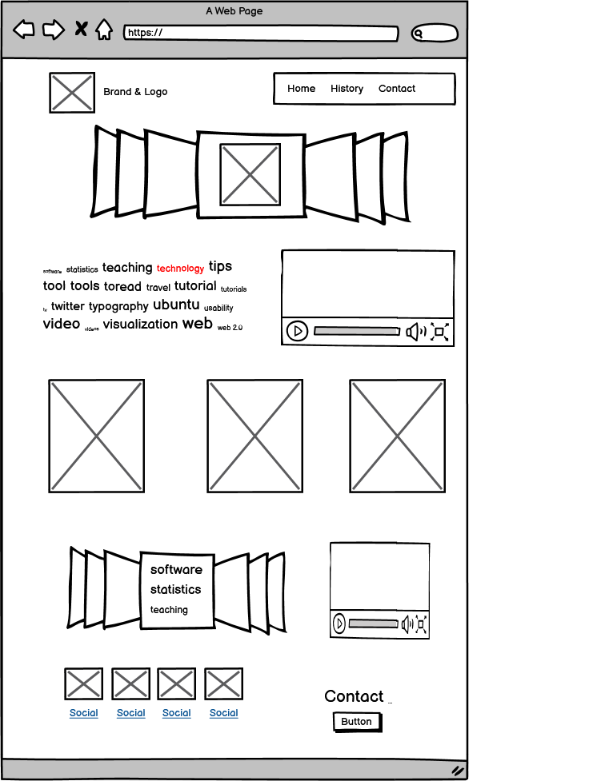
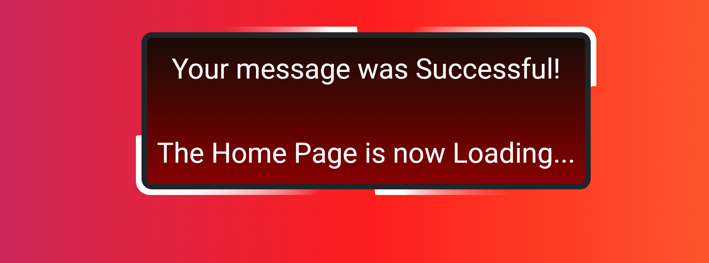

 An introductory website aimed at informing the reader about the evolution and transition of Jiu-Jitsu throughout the world, and how anyone can start today!

 

## Overview

Little Orgiami is designed to be a seemless flow of information for the reader to enjoy, understand, and use. 

This is accomplished through three static HTML/CSS pages: 

### The First Page

The index page contains demonstation videos, brief informative articles, and interactive elements that aim to inspire confidence in the user.

### The Second Page

The history page utilises scroll animations to tell the story of Jui-Jitsu as it travelled from Japan through brazil to the rest of the world. 

### The Final Page

The contact page allows users to send a message through a bootstrap form, in order to foster a community around Little Origami.

### Additional Pages 

Two additional pages were added to increse the depth and flexability. 

#### 404 Page

The 404 page enabled the early deployment and review of the site. As content was updated so to were unfinished link that lead to the 404 page. 

#### Confirmation Page

The confimation page adds depth to form submission experience. Thanking the user for their input before returning them to Home Page completing their journey.

## UX

The overall design of Little Origami was to be a balance between striking and elegent. Reflective of the current trends within the martial arts space. 

Libral use of contrasting colours, with bold images caputes the striking element. While, the fonts and the flow of the overall information seek to provide an aesthetic of elegence or refinement.

### Colour Scheme 

A trend among martial arts website is to use red, black, and yellow on a white background. This is a nod to the white gui adorned by the different coloured belts. Grey and darker shades are generally thrown in to contast these colours. The effect is an overall refined but striking website; perfect for martial arts. 

For this project, I chose to mostly follow this trend. As the most commonly used colours were black, yellow, and red. The colour palette looks as follows: 

#### Color Application 

I opted to use #212529 - Eerie Black as the background. It tied the website's logo, content, and design better than a lighter alternative. The logo and branding are the focal point for this decision as it is better highlighted by the darkness. 

The #FFFF00 - Yellow, FF0000 - Red, & #870000 - Dark red were all chosen to make the website as stiking as possible, and were used as follows:

- #FFFF00 - Yellow was use for the all the primary links and headings. 

- #FF0000 - Red was used for all subheadings. 

- #870000 - Dark Red was used in combination with black as a gradient background colour. 

- #FFFFFF was used for the primary text as to keep good contrast. 

- #000000 was used in certain instances when the background was of a lighter colour. 

#### Additional Colours 

For the two additional pages, I chose an alternative background to add some personallity into the project. As way of leaving my mark (a trademark) on the project. 

The colours I used in a 45&deg; gradient are as follows:

- #833AB4 - Grape 
- #FD1D1D - Red 
- #FCB045 - Orange (web)

### Typography

The aim of the type and icons is to create a fluid reading experience, but displayed in an eastern style. 

The eastern style gives an impression of elegency and refinement, but also adds legitimacy. Legitimacy that can be traced back through history. Therefore, this is a very important consideration for the website, and is achieved through the following fonts & icons:
 
- [Protest Revolution](https://fonts.google.com/specimen/Protest+Revolution?query=protest+revolution) was used for the logo brand and primary headings.

- [Protest Strike](https://fonts.google.com/specimen/Protest+Strike?query=protest+strike) was used for the subheadings. 

- [Roboto](https://fonts.google.com/specimen/Roboto) was used for all the non-heading text.

- [Font Awesome](https://fontawesome.com) icons were used throughout the site, such as the navigation icons in the header.

- [Bootstrap Native Font Stack](https://getbootstrap.com/docs/5.0/content/reboot/) was used as a back-up collection of font families.

- Sans-Sarif was used as a final redundant font. 

Protest Revolution & Strike were a great choice to represent more tranditonal eastern styles, while Roboto creates a nice reading expience for the bulk of the content. 

The Font Awesome icons were a great addition to the website adding an extra layer of refinement, especially using the east-asia-world icon for the history navigaiton link. 

## User Stories

### New Site Users

- As a new site user, I would like to enjoy reading about my hobby, so that I can have a great day.

- As a new site user, I would like to learn about Jui-Jitsu, so that I can have more confidence to start practicing.

- As a new site user, I would like to find reputable content on Jui-Jitsu, so that I know what I'm learning is legitimate.

- As a new site user, I would like to understand how I start doing this today, so that I can start today.

- As a new site user, I would like the content to be accessible to me, so that I can enjoy my hobby.

### Returning Site Users

- As a returning site user, I would like to help contribute to the community, so that I can feel connected.

- As a returning site user, I would like to keep finding new features and content, so that I can become more engaged.

- As a returning site user, I would like to reliably see what I'm expecting, so that I can keep enjoying the content I've come to love.

## Wireframes

To follow best practice, wireframes were developed for mobile, tablet, and desktop sizes.
I've used [Balsamiq](https://balsamiq.com/wireframes) to design my site wireframes.

### Mobile Wireframes

 Click here to see the Mobile Wireframes 

Home
  - 

History
  - 

Contact
  - 

### Tablet frames

 Click here to see the Tablet Wireframes 

Home
  - 

History
  - 

Contact
  - 

### Desktop Wireframes

 Click here to see the Desktop Wireframes 

Home
  - 

History
  - 

Contact
  - 

## Features

### Existing Features

- **Bootstrap 5 - Navigation bar**

    - An easy to use navigation menu, that gives user-friendly access to all the available content on the site. This benifits the users by respecting their time. Overall positively adding to their user experience.

- **Bootstrap 5 Carosuel - Hero Banner**

    - A striking introductory slideshow aimed at showcasing interesting aspects of Jui-Jitsu in picture form. The focal point can then be used to draw users attention to something more specific in the future. This benefit the user by giving them a sense of what the website is about. 

- **Introduction-Text**

    - The introductory section aims to give guidence to the user, by inform them the intent of the website and where to go next. Therefore, this paragraph was designed as a sign post, so it had to be short to the point with as much information as possible for the user to navigate more quickly. 

- **Introductory-Video**

    - Joe Rogan is one of the most well known people in the world, and is very knowledgable about Jiu-Jitsu. As he himself has a black belt and is a commentator for the UFC. Adding this content here breaks up the text for the user giving them something else entertaining to enjoy. The value this delivers to the website is legitamcy, as Joe Rogan is reputable source on the sport that many people like. 

- **The Technique Cards**

    - The technique cards are animated bootstrap cards. That reveal conent hidden on teh back. The goal was to present the in an interest way, with this idea representing the flipping off an opponent in Jiu-Jitsu. This is great an interactive element of the website that require no JS. Making run times faster and a better overall user experience. 

- **Beginner's Guide**

    - The beginner's guidue is short list of helplful tips the user can use to feel more confident to make a decision. Instead of writing a list staking the infomaiton in a Bootstrap carousel made it more fun and interactive for the user. Improving the overall experience. 

- **Demonstation Videos**

    - The demonstation videos were extra content added, to fill the space. To make it more interesting to the user. 

- **Footer**

    - The footer is a simple collect of social media links, a direct link to the contact page, and a call to action. Giving the user options and to keep them moving through the website. 

- **History Page - Scroll Animations**

    - The scroll animaitons add an entertainment value to the text. Making the content more engaging and valuable to the user. 

- **Contact Form**

    - The contact form allows the users to feel more connected to the website. To form a community around Little Orgiami. Legitimising the site and potentially creating repeat visiting users. 

- **404 Cats**

    - The page was design to incentavise free bug reporting and was seen as a great opportunity for user relations. 

- **Confirmation Message**

    - The confimration message provides assurance to the user their request was sent. It's an additional layer of design quality.

### Future Features 

- **Community Support**
    - To increase the community around Little Origami the following features could be introduced:
        - Q & A Forum
        - Message Board 
        - Dojo Review 

- **Additional Animations**
    - Additional animations would be bring more of the content to life.

- **Finding a Dojo Near You**
    - Using the Google API to find dojos near the addresses of the users, to make the value propersition of the website higher.

- **Pop-out Videos**

  - Allow the videos to be popped out and stick with the user for a more enjoyable experience. 

 - **Add Visual Ques** 

   - Add visual ques to the flip-cars, to make the more apparent that they flip. 

## Tools & Technologies Used

- [Git](https://git-scm.com) used for version control. (`git add`, `git commit`, `git push`)
- [GitHub](https://github.com) used for secure online code storage.
- [VSCode](https://code.visualstudio.com) used as my local IDE for development.
- [HTML](https://en.wikipedia.org/wiki/HTML) used for the main site content.
- [CSS](https://en.wikipedia.org/wiki/CSS) used for the main site design and layout.
- [GitHub Pages](https://pages.github.com) used for hosting the deployed front-end site.
- [Bootstrap](https://getbootstrap.com) used as the front-end CSS framework for modern responsiveness and pre-built components.

## Testing

For all testing, please refer to the [TESTING.md](TESTING.md) file.

## Deployment

The site was deployed to GitHub Pages. The steps to deploy are as follows:

- In the [GitHub repository](https://github.com/patrickaod/Little-Origami), navigate to the Settings tab 
- From the source section drop-down menu, select the **Main** Branch, then click "Save".
- The page will be automatically refreshed with a detailed ribbon display to indicate the successful deployment.

The live link can be found [here](https://patrickaod.github.io/Little-Origami)

### Git Commit Messages

I've become aware that I've been using the wrong tense for my commit messages. This mistake unfortuately can't be remedied, but moving forwards I will use the presenet tense when sending messages. 

### Local Deployment

This project can be cloned or forked in order to make a local copy on your own system.

#### Cloning

You can clone the repository by following these steps:

1. Go to the [GitHub repository](https://github.com/patrickaod/Little-Origami) 
2. Locate the Code button above the list of files and click it 
3. Select if you prefer to clone using HTTPS, SSH, or GitHub CLI and click the copy button to copy the URL to your clipboard
4. Open Git Bash or Terminal
5. Change the current working directory to the one where you want the cloned directory
6. In your IDE Terminal, type the following command to clone my repository:
	- `git clone https://github.com/patrickaod/Little-Origami.git`
7. Press Enter to create your local clone.

Alternatively, if using Gitpod, you can click below to create your own workspace using this repository.

Please note that in order to directly open the project in Gitpod, you need to have the browser extension installed.
A tutorial on how to do that can be found [here](https://www.gitpod.io/docs/configure/user-settings/browser-extension).

#### Forking

By forking the GitHub Repository, we make a copy of the original repository on our GitHub account to view and/or make changes without affecting the original owner's repository.
You can fork this repository by using the following steps:

1. Log in to GitHub and locate the [GitHub Repository](https://github.com/patrickaod/Little-Origami)
2. At the top of the Repository (not top of page) just above the "Settings" Button on the menu, locate the "Fork" Button.
3. Once clicked, you should now have a copy of the original repository in your own GitHub account!

### Local VS Deployement 

 The local deployment of a website exists on a developer's computer during the development phase, where changes and testing occur. The live deployment of a website refers to the process of making the finalized and tested website live on a web server for public access. The local environment is a controlled and private space for development, while the deployment is the public-facing version of the website.

## Credits 

### Content

| Source | Location | Notes |
| --- | --- | --- |
| [Markdown Builder](https://tim.2bn.dev/markdown-builder) | README and TESTING | tool to help generate the Markdown files |
| [Chris Beams](https://chris.beams.io/posts/git-commit) | version control | "How to Write a Git Commit Message" |
| [Bootstrap](https://getbootstrap.com/docs/5.0/components/navbar/) | entire site | responsive HTML/CSS/JS navbar |
| [Bootstrap](https://getbootstrap.com/docs/5.0/components/carousel/) | home page | carousel |
| [BBbootstrap](https://bbbootstrap.com/snippets/bootstrap-5-flipping-cards-for-catalog-29291738) | home page | Bootstrap 5 Flipping cards for catalog |
| [Bootstrap](https://getbootstrap.com/docs/5.0/components/buttons/) | entire site | Buttons |
| [mdn web docs_](https://developer.mozilla.org/en-US/docs/Web/HTML/Element/video) | home page | The Video Embed element tutorial |
| [mdn web docs_](https://developer.mozilla.org/en-US/docs/Web/CSS/CSS_scroll-driven_animations) | history page | scroll animation tutorial |
| [YouTube](https://www.youtube.com/watch?v=UmzFk68Bwdk&t=29s&ab_channel=KevinPowell) | history page | scroll animation demo |
| [Bootstrap](https://getbootstrap.com/docs/5.0/forms/overview/) | contact page | contact form |
| [YouTube](https://www.youtube.com/watch?v=BjeoJu6agQk&ab_channel=FlorinPop) | confirmation page | rotating border |
| [Bootstrap](https://getbootstrap.com/docs/5.0/utilities/flex/) | entire site | flex utility |
| [Bootstrap](https://getbootstrap.com/docs/5.0/layout/grid/) | history page | grid layout |

### Media

| Source | Location | Type | Notes |
| --- | --- | --- | --- |
| [Pexels](https://www.pexels.com/photo/a-group-of-people-in-taekwondo-uniform-standing-near-the-brick-wall-7045669/) | home page | image | banner image #1 |
| [Pexels](https://www.pexels.com/photo/a-man-practicing-kick-boxing-while-on-the-beach-5895898/) | home page | image | banner image #2 |
| [Pexels](https://www.pexels.com/photo/men-doing-martial-arts-8612067/) | home page | image | banner image #3 |
| [Youtube](https://www.youtube.com/watch?v=JpRJLg9Lq5g&source_ve_path=Mjg2NjY&feature=emb_logo) | home page | video | intro video |
| [Pexels](https://www.pexels.com/photo/woman-grabbing-a-man-6765030/) | home page | image | technique card #1 |
| [Pexels](https://www.pexels.com/) | home page | image | technique card #2 |
| [Pexels](https://www.pexels.com/) | home page | image | technique card #3 |
| [Pexels](https://www.pexels.com/) | home page | images | beginner's guide backgorund |
| [Pexels](https://www.pexels.com/video/woman-putting-on-her-karategi-and-tying-her-white-belt-7045267/) | home page | video | demonstration video #1 |
| [Pexels](https://www.pexels.com/video/men-bowing-down-at-each-other-6253406/) | home page | video | demonstration video #2 |
| [Pexels](https://www.pexels.com/video/men-doing-judo-6254567/) | home page | video | demonstration video #3 |
| [Pexels](https://www.pexels.com/photo/turned-on-street-light-590478/) | history page | images | background #1 |
| [Pexels](https://www.pexels.com/photo/girl-walking-on-street-with-brazilian-flag-on-wall-16162211/) | history page | images | background #2 |
| [Giphy](https://giphy.com/gifs/SappySealsCommunity-sappy-1-of-one-U6GixhwsEXOlZSYvqq?utm_source=iframe&utm_medium=embed&utm_campaign=Embeds&utm_term=) | 404 Page | GIFs | 404 Cat #1|
| [Giphy](https://giphy.com/gifs/SappySealsCommunity-sappy-1-of-one-BvNIKrJKQOEnATn76J?utm_source=iframe&utm_medium=embed&utm_campaign=Embeds&utm_term=) | 404 Page | GIFs | 404 Cat #2|
| [Giphy](https://giphy.com/gifs/SappySealsCommunity-sappy-1-of-one-1fnnX7RL2JrlUvII1V?utm_source=iframe&utm_medium=embed&utm_campaign=Embeds&utm_term=) | 404 Page | GIFs | 404 Cat #3|
| [FontAwesome](https://fontawesome.com/icons/house?f=classic&s=solid) | entire site | images | house navigation icon |
| [FontAwesome](https://fontawesome.com/icons/earth-asia?f=classic&s=solid) | entire site | images | world navigation icon |
| [FontAwesome](https://fontawesome.com/icons/comments?f=classic&s=solid) | entire site | images | comment navigation icon |
| [FontAwesome](https://fontawesome.com/icons/snapchat?f=brands&s=solid) | entire site | images | social media icons |
| [FontAwesome](https://fontawesome.com/icons/instagram?f=brands&s=solid) | entire site | images | social media icons |
| [FontAwesome](https://fontawesome.com/icons/facebook?f=brands&s=solid) | entire site | images | social media icons |
| [FontAwesome](https://fontawesome.com/icons/x-twitter?f=brands&s=solid) | entire site | images | social media icons |
| [Shields.io](https://shields.io/) | README | images | shields |
| [BannerMaker](https://banner.godori.dev/) | README | images | banner |

#### Missing Links

Some of media links direct to the main site of where the website were found. This is due to not having all of them being saved for whatever reason, and all attempts to find them again failed. Moving forward, I'll make it a priority to save all media whether it is used or not. 

### Acknowledgements

- I would like to thank my Code Institute mentor, [Tim Nelson](https://github.com/TravelTimN) for his support throughout the development of this project.
- I would like to thank the [Code Institute](https://codeinstitute.net) tutor team for their assistance with troubleshooting and debugging some project issues.
- I would like to thank the [Code Institute Slack community](https://code-institute-room.slack.com) for the moral support; it kept me going during periods of self doubt and imposter syndrome.