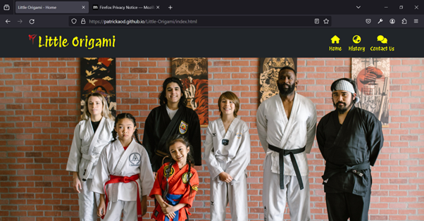
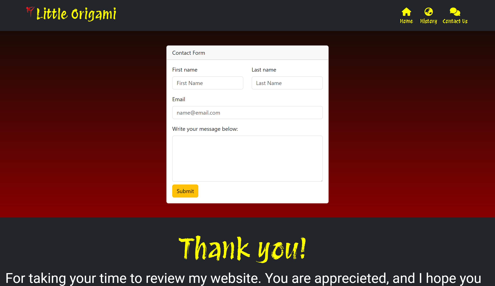
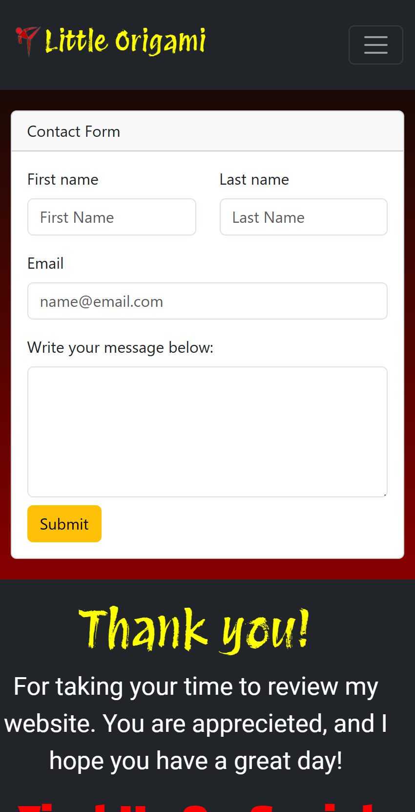
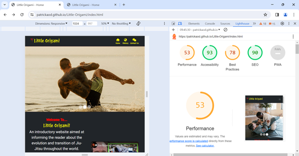

# Testing

Return back to the [README.md](README.md) file.

## Code Validation

### HTML

I have used the recommended [HTML W3C Validator](https://validator.w3.org) to validate all of my HTML files.

| Directory | File | Screenshot | Notes |
| --- | --- | --- | --- |
|  | 404.html |  | |
|  | confirmation.html |  | |
|  | contact.html |  | |
|  | history.html |  | |
|  | index.html |  | |

### CSS

I have used the recommended [CSS Jigsaw Validator](https://jigsaw.w3.org/css-validator) to validate all of my CSS files.

| Directory | File | Screenshot | Notes |
| --- | --- | --- | --- |
| assets | style.css |  | ??? |

## Browser Compatibility

I've tested my deployed project on multiple browsers to check for compatibility issues.

| Browser | Home | History | Contact | 404 | Confirmation | Notes
| --- | --- | --- | --- | --- | --- | --- |
| Chrome |  |  |  |  |  | Works as expected |
| Firefox |  |  |  |  |  | Works as expected |
| Edge |  |  |  |  |  | Works as expected |

## Responsiveness

I've tested my deployed project on multiple devices to check for responsiveness issues.

| Device | Home | History | Contact | Notes |
| --- | --- | --- | --- | --- |
| Mobile (DevTools) |  |  |  | Works as expected |
| Tablet (DevTools) |  |  |  | Works as expected |
| Desktop (DevTools) |  |  |  | Works as expected |
| XL Monitor (DevTools) |  |  |  | Works as expected |
| 4K Monitor (DevTools) |  |  |  | Works as expected, contact form starting to shrink |
| Mobile Medium (DevTools) |  |  |  | Works as expected |
| Mobile large (DevTools) |  |  |  | Works as expected |

## Lighthouse Audit

I've tested my deployed project using the Lighthouse Audit tool to check for any major issues.

| Page | Mobile | Desktop | Notes |
| --- | --- | --- | --- |
| Home |  |  | Slow response time due to large images |
| History |  |  | Some minor warnings |
| 404 |  |  | Some minor warnings |
| Confirmation |  |  | Good Response time |
| Contact |  |  | Good Response time |

## User Story Testing 

| User Story | Screenshot |
| --- | --- |
| As a new site user, I would like to enjoy my hobby, so that I can have a great day. |  |
| As a new site user, I would like to to learn, so that I can feel more confident. |  |
| As a new site user, I would like to find reputable content on Jui-Jitsu, so that I can have confidence in what I'm learning. |  |
| As a new site user, I would like to to learn more, so that I can start today. | 
| As a returning site user, I would like to help contribute to the community, so that I feel more conenected. |  |
| As a returning site user, I would like to finding new features and content, so that I can be more engaged. |  |

## Bugs
> There are no remaining bugs that I am aware of.